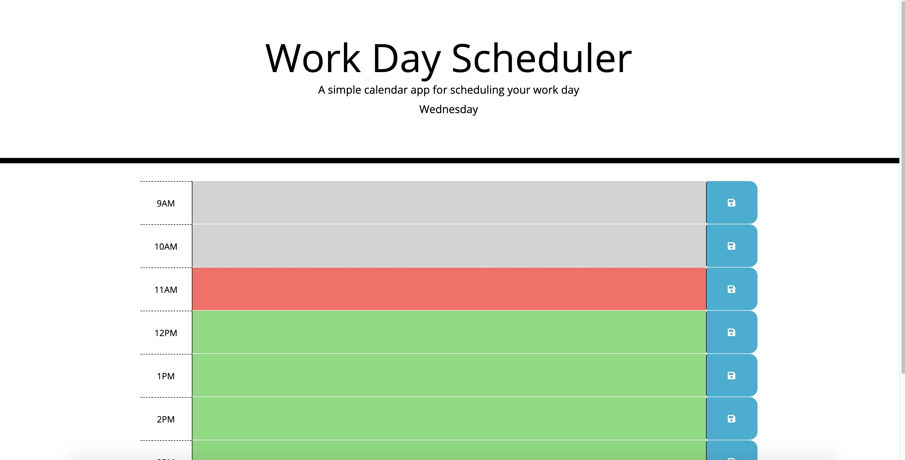
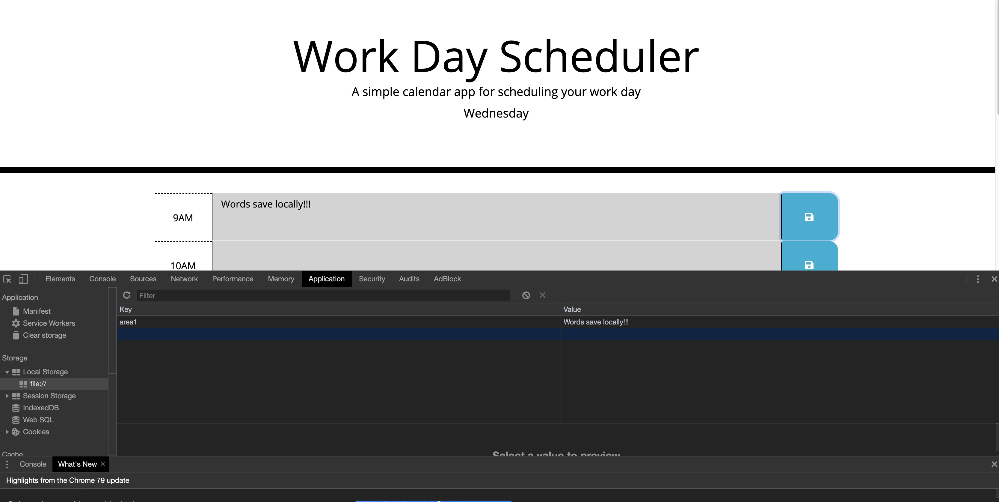

# 05-Daily-Planner

## Overview

The purpose of this application is to allow the user to place plans in the text feilds and save them locally so that they can come back to this and remind them of the items they include in the text feild. A Daily Planner!

### Gallery

Main View:

Local Storage View:

### Problem

NOTHING!!!

### Solution

N/A!!!

## Tech and Features Used

* HTML
* CSS
* JavaScript
* JQuery
* Third Party APIs

## How to use

Simply input text into the text feilds and click the save button if you want to save that info.

<!-- ## Technical Overview

1. The main component (PullMultiple) contains an array of the user ID's from the users input.
2. That component has a generator function that iterates over the array and adds the ID #'s one by one to an array to be processed.
3. For every ID # in the array to be processed, a "DataGatherer" component is created.
4. This DataGatherer component fires off all of the api calls and renders the progress to the screen.
5. These API calls are called in an asynchronous fashion in order to reduce strain on the server handling the queries.
6. As the API calls are being made, links to the finished .csv files are being saved to state.
7. The download button downloads several links at once from the saved links in state.
8. When all API calls have finished for an ID, the next iterator of the generator function is fired and the next ID goes through it's gathering phase.
9. The reset button cancels all API calls and bring highest component back to empty. -->

Link to example readme:

https://braydon-nelson.github.io/05-Daily-Planner/